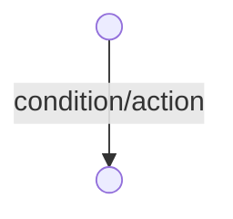

# State Charts

- hierarchical state machine
- tools exist to convert them into SW and HW, thus we can make state charts to represent our state and logic, and produce their implementations with little development cost

- definitions
	- active state: current state
	- basic state: has no sub-states
	- super state: has sub-states
	- ancestor states: containing cases
	- OR super state: in exactly 1 sub-state when its active
		- models sequential execution
	- AND super state: in all sub-states when its active
		- models concurrent execution

- 
- h state represents that when the super state is left and entered back into, the previous sub-state within the super state is remembered and re-rentererd
- red dot is current active state

- entering ANd-super-state menas entering all sub-states
- leaving And-SuperSstate means leaving all sub-states
- can transition into sub0state of the ANd-superstate

- timers: can be quite usefule in reactive system:
	- ex. timers are an or superstate but you can only stay within in it for x amount of time
		- stays in the state for at most the stated time
		- it must always have a timeout transition into another state
	- ex2

- variables:
	- used to encode states with large numbers of values
	- e.g. to model a queuing system
		- use states to encode actions such as service
		- number of clients encoded as a variable, allowing us to avoid state explosion
- transitions:
	- can be conditioned on those variables

## state chart semantics:

- models synchronous behaviour: all transitions that are ready fire at once
	- 1. evaluate events and conditions
	- 2. determine transitions happen
	- 3 fire all transitions and apply any actions
-  time semantics
	- 1. evaluate all internally generated events 
	- 2. apply transitions and repeat until stable
		- repeat 1 and 2
	- 3. advance simulation time to next external event (or timeout_)
- examples:
	- models a swap
	- when we transition these states we can set initial values (see edge on the right)
	- when event e arrives
		- left state assigns 0 to a
		- right state assigns 1 to b
	- this translates well to hardware
	- can profue inefficient software implementations
	- state charts theere are tools that bring