```mermaid
---
displayMode: compact
---
gantt  
    dateFormat X
    axisFormat %s
    tickInterval 1second
    section 0
	    acc <= 0:              active, s00, 0, 1
	    read atmp, btmp:               s01, 1, 2
	    acc+=atmp*btmp: active, s02, after s01, 1s
    section 1
	    read atmp, btmp:          s11, after s01, 1s
	    acc+=atmp*btmp: active, s12, after s11, 1s
	section ...
		...: active, sdot, 0, 6
	section N
	    read atmp, btmp:        s21, after s11, 1s
	    acc+=atmp*btmp: active, s22, after s21, 1s
	    rtmp <= acc:            s23, after s22, 1s
```

# Application: Matrix Multiplication

- Now that we have discussed the 3 types of parallelism:
	- [Instruction Level Parallel](2.2-instruction-level-parallelism.md) (datapath parallelism)
	- [Data Level Parallelism](2.3-data-level-parallelism.md) (loop parallelism)
	- [Transaction Level Parallelism](2.4-transaction-level-parallelism.md) (dataflow parallelism)

- We will apply these techniques to a commonly used application: __Matrix Multiplication__

```ad-abstract
- We want to calculate $R = A \times B$ where:
	- $R \in \mathbb R^{I\times J}$ 
	- $A \in \mathbb R^{I\times K}$
	- $B \in \mathbb R^{K\times J}$
```

```ad-info

Assumptions/Constraints:

- $I = J = K = 64$
- hardware target: Xilinx Ultra Scalet
- matrix inputs and outputs are stored in DDR (global) ram, not BRAM (local), and thus, must be accessed via streaming interface

```

## Naive Solution

```c
typedef int8_t a_b_t;
typedef int16_t r_t;

void multiply(a_b_t a[I][K], a_b_t a[I][K], r_t r[I][K]) {
	for(int i=0; i<I; i++)
		for(int j=0; j<J; j++) {
			r[i][j] = 0;
			for(int k=0; k<K; k++)
				r[i][j] += a[i][k] * b[k][j];
		}
}
```

```ad-warning
2 problems with the naive solution
- Matrices in `C`, `C++` are stored in row-major order
- Streaming interfaces are optimized for sequential data flow, making them unsuitable for operations that require random access patterns, as typical in matrix operations stored in row-major order
```

```ad-failure
- Therefore the code cannot be synthesized because the streaming interface requires sequential accesses to whatever its streaming
```

- access pattern:


### Solution 1: Copy to Temporary

```c
void multiply(a_b_t a[I][K], a_b_t b[J][K], r_t r[I][J]) {
	#pragma HLS INTERFACE axis register both port=r
	#pragma HLS INTERFACE axis register both port=b
	#pragma HLS INTERFACE axis register both port=a
	a_b_t atmp[I][K], btmp [K][J];
	r_t rtmp[I][J];

	// step 1: copy A and B to local
	Row_a_copy: for(int i=0; i<I; i++)
		Col_a_copy: for(int k=0; k<K; k++)
			atmp[i][k] = a[i][k];
	Row_b_copy: for(int k=0; k<K; k++)
		Col_b_copy: for(int j=0; j<J; j++)
			btmp[k][j] = b[k][j];

	// step 2: calculate matmul
	Row: for(int i=0; i<I; i++)
		Col: for(int j=0; j<J; j++) {
			rtmp[i][j] = 0;
			Product: for(int k=0; k<K; k++)
			rtmp[i][j] += atmp[i][k] * btmp[k][j];
		}

	// step 3: copy local to R
	Row_res_copy: for(int i=0; i<I; i++)
		Col_res_copy: for(int j=0; j<J; j++)
			r[i][j] = rtmp[i][j];
}
```

- (1) It first copies the input matrices `a` and `b` into temporary matrices `atmp` and `btmp` to facilitate streaming access
- (2) Then, it computes the product of `a` and `b` using a triple nested loop, storing intermediate results in `rtmp`
- (3) Finally, it copies the computed result from `rtmp` back to the output matrix `r`
	- The `#pragma HLS INTERFACE` directives instruct the HLS tool to configure the specified ports (`a`, `b`, and `r`) for streaming access, optimizing for hardware implementation
	


### Solution 2: Pipelining

```c
void multiply(a_b_t a[I][K], a_b_t b[J][K], r_t r[I][J]) {
	#pragma HLS INTERFACE axis register both port=r
	#pragma HLS INTERFACE axis register both port=b
	#pragma HLS INTERFACE axis register both port=a
	a_b_t atmp[I][K], btmp [K][J];
	r_t rtmp[I][J];

	// step 1: copy A and B to local
	Row_a_copy: for(int i=0; i<I; i++)
		Col_a_copy: for(int k=0; k<K; k++)
			#pragma HLS PIPELINE
			atmp[i][k] = a[i][k];

	Row_b_copy: for(int k=0; k<K; k++)
		Col_b_copy: for(int j=0; j<J; j++)
			#pragma HLS PIPELINE
			btmp[k][j] = b[k][j];

	// step 2: calculate matmul
	Row: for(int i=0; i<I; i++)
		Col: for(int j=0; j<J; j++) {
			rtmp[i][j] = 0;
			Product: for(int k=0; k<K; k++)
				#pragma HLS PIPELINE
				rtmp[i][j] += atmp[i][k] * btmp[k][j]; // NOTE
		}

	// step 3: copy local to R
	Row_res_copy: for(int i=0; i<I; i++)
		Col_res_copy: for(int j=0; j<J; j++)
			#pragma HLS PIPELINE
			r[i][j] = rtmp[i][j];
}
```

```ad-note
- The only difference here is the addition of the `#pragma HLS PIPELINE`
- The `#pragma HLS PIPELINE` directive enables the loop to be pipelined, significantly improving the throughput by allowing each iteration of the loop to overlap in execution
```

```ad-failure
- We cannot pipeline step 2, the product, because of a RAW (read-after-write)
```

- Each calculation of `rtmp[i][j] += atmp[i][k] * btmp[k][j]` depends on the last iteration
- This dependency creates a loop-carried dependency, where the output of one iteration (the accumulation of products) is required for the next

```mermaid
---
displayMode: compact
---
gantt  
    dateFormat X
    axisFormat %s
    tickInterval 1second
    section 0
	    read atmp, btmp, rtmp:          s01, 0, 1
	    rtmp <= rtmp+atmp*btmp: active, s02, after s01, 1s
    section 1
	    read atmp, btmp, rtmp:  crit, s11, after s01, 1s
	    rtmp <= rtmp+atmp*btmp: crit, s12, after s11, 1s
```


- In hardware, this means you can't start computing the next set of products until the previous set is fully calculated and added, limiting the ability to pipeline these operations without introducing additional mechanisms to manage these dependencies
- thus, we have to leave it as:

```mermaid
---
displayMode: compact
---
gantt  
    dateFormat X
    axisFormat %s
    tickInterval 1second
    section 0
	    read atmp, btmp, rtmp:          s01, 0, 1
	    rtmp <= rtmp+atmp*btmp: active, s02, after s01, 1s
    section 1
	    read atmp, btmp, rtmp:          s11, after s02, 1s
	    rtmp <= rtmp+atmp*btmp: active, s12, after s11, 1s
```




## Solution 3: temporary register

- To solve the pipelining issue in the last solution, we create a temporary register `acc` for accumulation of the product operation

```c
// step 2: calculate matmul
Row: for(int i=0; i<I; i++)
	Col: for(int j=0; j<J; j++) {
		r_t acc = 0;
		Product: for(int k=0; k<K; k++)
			#pragma HLS PIPELINE
			acc += atmp[i][k] * btmp[k][j];
		rtmp[i][j] = acc;
	}
```



```ad-note
- While we previously had to explicity read `rtmp` in solution 2, we do not have to for `acc`
- This is because, reading from `acc` is negligible since it is in a local register in our digital circuit, NOT in BRAM like `rtmp`
- Thus the "read" `acc` is omitted since it is done in the same stage as the multiplication without increasing the clock period significantly
```

```ad-question
How does incrementing a local variable, `acc` differ from directly incrementing `rtmp[i][j]`?
- As mentioned previously, by replacing `rtmp[i][j]` with `acc` we are reading and writing to `acc`, data in a local register, (instead of `rtmp[i][j]`, data in the BRAM,) we can read and write to/from `acc` in one stage
- This was not the case for solution 2, where we needed the "read `rtmp`" in the previous stage
- This solves the RAW (read-after-write) issue
```


## Solution 4: Unrolling the Product Loop

- Each iteration of `Product` requires 1 read from `atmp` and `btmp` each
- Unrolling our loop will require __more parallel reads__ of A and B
- Therefore we will need to either partition or reshape
- Our objective: determine the maximum unroll factor such that BRAM usage doesn't increase over that of Solution 3

```ad-info
BRAM specifications:
- 18 kbit width
- 1-18 bit width: can be configured to store and manage data with widths ranging from 1 bit up to 18 bits
- dual ported: means that the memory allows two independent accesses (reads or writes) to occur simultaneously on different addresses
```

- Looking at the BRAM specs, we could unroll with $M=2$ without partitioning or reshaping due to the dual ported memory

- Existing BRAM usage (in solution 3):
	- size of A or B = $64\times64\times8\text{bit}=32\text{kbit}$
		- $\text{ceil}(\frac{32\text{kbit}}{18\text{kbit}}) = 2$ BRAMs
	- size of R = $64\times64\times16\text{bit}=64\text{kbit}$
		- $\text{ceil}(\frac{64\text{kbit}}{18\text{kbit}}) = 4$ BRAMs
	- solution 3 uses 2 BRAMs of width 8 for each of $A$ and $B$ and 4 BRAMs of width 16 for $R$
		- 8 total

```c
void multiply(a_b_t a[I][K], a_b_t b[J][K], r_t r[I][J]) {
	#pragma HLS INTERFACE axis register both port=r
	#pragma HLS INTERFACE axis register both port=b
	#pragma HLS INTERFACE axis register both port=a
	a_b_t atmp[I][K], btmp [K][J];
	
	#pragma HLS ARRAY_RESHAPE variable=atmp cyclic factor=4 dim=2
	#pragma HLS ARRAY_RESHAPE variable=btmp cyclic factor=4 dim=1
	r_t rtmp[I][J];

	// step 1: copy A and B to local

	// step 2: calculate matmul 
	Row: for(int i=0; i<I; i++)
		Col: for(int j=0; j<J; j++) {
			r_t acc = 0;
			Product: for(int k=0; k<K; k++)
				#pragma HLS PIPELINE
				#pragma HLS UNROLL factor=8
				acc += atmp[i][k] * b[k][j];
			rtmp[i][j] = acc;
		}

	// step 3: copy local to R
```

```ad-example
#### Approach 1
- Reshape with $M=4$
- Note: all of the approaches will use `cyclic` partitioning since sequential accesses are being done
- This cyclically splits the size $N$, 8 bit array into $M=4$ subarrays of size $N/4$ and then merges them into a single, $N/4$ length array with elements with bitwidth: $8\times M=32$
- Each BRAM can support a single 18 bit read, thus, we must check if our hardware can handle our desired bits/cycle
	- $\lceil \frac{32\text{kbit}}{18\text{kbit}} \rceil = 2$
	- We have 2 BRAMs, so this is possible
- no need to reshape $R$?

#### Approach 2

- reshape with $M=8$
- Splits the size $N$, 8 bit array into $M=8$ subarrays of size $N/8$ and then merges them into a single, $N/8$ length array with elements with bitwidth: $8\times M=64$
- $\lceil \frac{64\text{kbit}}{18\text{kbit}} \rceil = 4$
- the number of BRAMs for A and B must double ($2 \rightarrow 4$) to read 64 bit/cycle
	
#### Approach 3

- partitioning with $M=4$
- width of $A$ or $B$ = $8 bits \times 4 = 64 bits$
- this requires 1 BRAM per partition


#### Conclusion

- We choose Approach 1

```


## Solution 5: Tiling


## Solution 6: Transaction Parallelism

