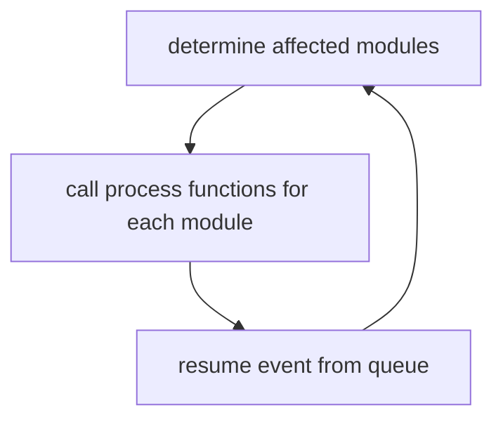

# Performance Estimation

## Usage

- 1. system-level (what we are going to be doing with system c)
	- based on the system specification
	- At the early stages of design, you use high-level specifications to estimate system performance. This helps guide decisions about hardware/software partitioning, determining which components should be implemented in hardware and which can be in software. However, because you're operating at a high level of abstraction, these estimations are fairly imprecise but offer a quick overview of system behavior
	- guides the hardware/software partitioning
	- tends to me failry imprecise since we are doing things at such a high level but it allows you to get a quick esitmation
	
- 2. validation
	- based on the implementation
	- confirms non-functional requirements (latency, throughput, power consumption, etc)
	- tends to be more precise, slow
		- ex. cycle accurate modelling of a cpu
	
- methods
	- 1. measurement
		- for final estimation only
	- 2. simulation
		- from executable models (such as systemc)
	- main challenge with both of these methods (1, 2) is coverage
		- how do we decide what inputs to uses
			- how do you know we get all the edge cases for best/worse case behaviour
	- 3. probabilistic anaysis
		- based on distributions 
			- e.g. queueing theory: descirbes the chances of thisng happening ie. losing one message per 1000 for an N sized queue
	- 4. deterministic analysis
		- determine worst/base case latencies and bounds
		- e.g. task graph scheduling $\implies$ makespan
		- eg. real-time schudulability tests
	- these last two involve abstractions/simplifications


## discrete event simulation

- concurrent processes are modelled as hierarchies of modules
- we have modules and we can express their behaviour with imperative (eg. C) or declarative (eg logic/algebraic) languages
- state is the collection of variables in each module
- our modules have ports that exchange signals
- events are essentially exchanges of singals on these ports

- simulator must have certain pairts to simulate a system like this
	- 1. clock: tracks current time
	- 2. event queue: ordered by event times
		- events are executed one at a time
	- 3. modules
		- process functions are invoked for events that they are sensitive to
		- process functions manipulate variable and generate events
	- 
- simulation engine:
	- initialize:
		- initialize module variables and generate initial events


- new events may share the same time
	- they are executed in successive delta cycles (which have zero duration)

## systemc

- system-level modelling language
- can do functional (notime) to cycle accurate simulations
- `C++` libraru of templates and classes
- provides h/w created data types
- communication mechanisms
- event drivenn simulation kernel

- moduls: basic blocks
	- IO done through ports
	- habve processes that are schduled by the kernel

- processes:
	- `SC_THREAD`: called once, executes forever
	- `SC_METHOD` called whenever inputs change (based on a sensitivity list)

## ex. modelling a NAND gate

```cpp
// nand.c

#include <systemc>
using namespace sc_core;

SC_MODULE(nand) { // declare a module (basically a class)
	sc_in<bool> A, B;
	sc_out<bool> F;

	void evaluate() {
		F.write( !(A.read() && B.read()) );
	}
	SC~_CTOR(nand) { // constructor
		SC_METHOD(evaluate); // registers function with the simulations kernel
		sensitive << A << B; // sensitivity list for the last registered method
	}
}
```


![[Pasted image 20240307144053.png]]

```cpp
#include <systemc>
#include "nand.h"

using namespace sc_core;

SC_MODULE(xor) { // declare a module (basically a class)
	sc_in<bool> A, B;
	sc_out<bool> F;
	nand n1, n2, n3, n4;
	sc_signal<bool> s1, s2, s3;

	SC_CTOR n1("N1"), n2("N2"), n3("N3"), n4("N4") {
		n1.A(A);
		n1.B(B);
		n1.F(s1);
		
		SC_METHOD(evaluate); // registers function with the simulations kernel
		n2 << A << s1 << s2;

		n3(s1);
		n3(B);
		n3(s3);
	}
}
```


### channels

- communicaiton between modules
- sync promitives are used for synchronization
- interfaces define access methods to a channel
- bind module ports to interfaces

### sync primitives

- wait call: blocks SC_thread until desire event occurs
	- a thread gets started for module and is expectied to run cntinuoulsy
	- options:
		- wait(sc_event)
		- wait(time_out, sc_event)
		- wait(time)
- notify call: raise event
	- options:
		- event.notify()
		- event.notify(time) - schedule notification in the future
		- event.notify(SC_ZERO_TIME) - schedules notification at end of current time delta


## examples

```cpp
class write_if : public sc_interface // abstract class; cant instantiate
{
public:
	virual void write(char) = 0;
	virual void reset() = 0;
};

class read_if : public sc_interface
{
public:
	virtual void read(char &) = 0;
	virtual int num_available() = 0;
};

```

![[Pasted image 20240307145030.png]]
![[Pasted image 20240307145719.png]]

- functions block until they run completely in the simulator, no mutexes needed


```cpp
int sc_main() {
	top t1("top");
	sc_start(); // runs the simulation
}
```

