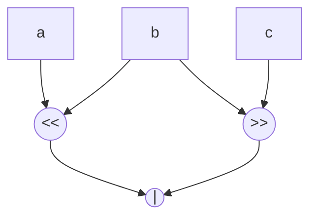

# ASIP: Application-Specific Instruction-Set Processor

- Application-Specific Instruction-Set Processors (ASIPs) are customizable microprocessors tailored for specific applications
- ASIPs optimize performance, power consumption, and area by incorporating only the necessary components and functionality for a particular application
- We discuss types of ASIPs and their functionality, particularly focusing on configurable architectures and extensible processors

## Configurable Architectures

- Configurable ASIPs allow designers to adapt the processor to specific application needs by modifying various aspects of the processor:

- **Functional Units**: Designers can choose the type and number of functional units based on the computational demands of the target application

- **Memory System**: The memory architecture can be tailored, such as optimizing with or without a Memory Management Unit (MMU), and configuring caches or omitting them for simplicity or cost reduction

- **Instruction Set Architecture (ISA) Optimization**: This involves modifying the ISA to better suit application requirements. This could include:

  - Adding custom instructions to accelerate specific tasks (e.g., CRC calculations)
  - Removing unused standard instructions to save space and reduce complexity
  - Custom execution modes
  - Error handling

- **Tools**: Development tools for these processors can generate Register Transfer Level (RTL) code and configure compilers to understand and optimally compile code for the modified ISA

## Extensible Processors

- Extensible processors provide a framework within which designers can integrate custom hardware accelerators or instructions:

- **NIOS II**: Offers a platform where designers can define up to 256 custom instructions

  - These are typically invoked through software macros, which abstract the hardware implementation from the programmer, simplifying development.
  - You (client) give them your hardware designs and they implement it on one chip (soft core CPU)
  - up to 256 custom instructions, invoked by software macros
    - e.g. `int y = ALT_CI_CRC(x); // x specifies it as a 32 bit`

- **Xtensa**: Allows for synthesized instructions where designers can specify new operations, register files, and even custom execution units. The processor's tools then generate necessary RTL, test benches, and integrate pipeline interlocks and data forwarding mechanisms.

- The provided example illustrates how a custom instruction (`add128`) could be defined in a processor like Xtensa and then used in a C program to perform operations on large data types

  - (128-bit in this case), which are not natively supported by standard processors

- This allows for significant performance improvements in applications requiring manipulation of large data sizes.

```
; use generator
; generator::regfile(name=>"L",
					 cname="long128",
					 sname=>"s"
					 width=>128);
opcode add128
add128 {assign sr=st+ss};

```

- given the above, the processor generator generates RTL, testbecnh, etc,
  - the RTL is automatically pipelined
  - also generates processor pipeline interlocks (hazard detection and stalling) and result bypass logic (data forwarding)
- to use the above in C:

```c
int main() {
    long 128 src1[N], src2p[N], src2[N], dtst[N];
    for(int i=0, i<N; i++)
	    dst[i]=add128(src[i], src2[N])
}
```

## instruction set synthesis

- motivation: how do you identify the best speed up for a program, which functions to synthesize custom functions for

- **1. Extract Control Flow Graph (CFG)**: Analyze the flow of the application to understand its structure and the interaction between its components

- **2. Analyze Data Flow Graph (DFG)** of each basic block: Identify potential custom instructions ("cuts") that can replace multiple existing operations

- **3. Estimate Area and Clock Cycles**: For each potential custom instruction, estimate the hardware resources required and the potential reduction in clock cycles.

- **4. Evaluate Application Speed-Up**: Using the estimated data, calculate how much speed each cut would bring to the application and how this translates into overall performance improvement.

- **5. Optimal Cut Selection**: Choose the best set of custom instructions considering constraints like silicon area and register file limitations, aiming to maximize the speed-up without exceeding these constraints.

- e.g basic block TODO



- an illegal cut is when there is a path going into and out of a cut

- the speed up, $S$, of a cut, $C$, can be computed as

$$
S=\frac{T_{tot}}{T_{tot}-n_c(T^C_{sw}-T^C_{hw})}
$$

- where
  - $n_c$ is the number of times a cut is exectued
  - $T^C_{sw}-T^C_{hw}$ is the drop in duration of the cut implemented in software vs hardware
- choose a set of cuts that maximize total speed up while staying within area constraints and register file limitations
