# Data Level Parallelism

## Loop Optimizations

- We will first discuss the things we can do with loops

### Pipelining Loop Iterations

- Essentially, we are making the instruction execution of each iteration overlap
- HLS tools can be instucted to pipeline (this is not default behaviour)

#### Basic example

- For example, take this code block:

```c
// N must be known at synthesis time
#define N 3
for(int i = 0; i<N; i++)
	basic_block(); // where L=2, and has 2 stages S1, S2
```

- Here is a unpipelined timing diagram:

```mermaid
---
displayMode: compact
---
gantt  
    dateFormat X
    axisFormat %s
    tickInterval 1second
    section 0
	    S1:        s01, 0, 1
	    S2:active, s02, after s01, 1s
    section 1
	    S1:        s11, after s02, 1s
	    S2:active, s12, after s11, 1s
    section 2
	    S1:        s21, after s12, 1s
	    S2:active, s22, after s21, 1s
```



- Pipelining does the following to the loop:

```mermaid
---
displayMode: compact
---
gantt  
    dateFormat X
    axisFormat %s
    tickInterval 1second
    section 0
	    S1:        s01, 0, 1
	    S2:active, s02, after s01, 1s
    section 1
	    S1:        s11, after s01, 1s
	    S2:active, s12, after s11, 1s
    section 2
	    S1:        s21, after s11, 1s
	    S2:active, s22, after s21, 1s
```



```ad-info
$$
L_0 = N \times L_{bb}
$$

$$
L_\text{pipelined} = N\times II + \underbrace{L_{bb}-II}_{L_0 \text{ without } II}
$$

- where:
	- $L_{bb}$ is the total latency (period) of the basic block
	- $L_0$ is the latency without pipelining
	- $L_\text{pipelined}$ is the latency after pipelining
	- $II$ is the initialization interval latency: the time it takes to initialize the basic block or the period of the first pipelining stage of the block
	- $N$ is the number of loop iterations to pipeline
	- Notice that the last term is $L_0$ without the initialization interval
```

```ad-note
- $L_\text{pipelined}$ scales by $N$ on the $II$, unlike $L_0$ which scaled with $L_{bb}$
- This is great since $L_{bb} \ge II$, and this becomes even more efficient the smaller the initialization interval gets relative to $L_{bb}$
```

- Thus, pipelining requires more hardware, but it allows us to execute the iterations of the loop in parallel
- However, what happens when there are data dependencies between each iteration of the loop?

#### Data Dependencies Example

```c
#define N 3
#define CONST 5

int a[N];
// do something with a
// ...

int tmp = 1;
int b[N];
for(int i = 0; i<N; i++) {
	tmp = (tmp*a[i]) + CONST;
	b[i] = tmp;
}
```

- in this example, the current iteration of the loop depends on the last - there is a data dependency

```mermaid
---
displayMode: compact
---
gantt  
    dateFormat X
    axisFormat %s
    tickInterval 1second
    section 0
	    load a[i]:            s01, 0, 1
	    _*tmp:        active, s02, after s01, 1s
	    tmp<=_+CONST:         s03, after s02, 1s
	    b[i]<=tmp:    active, s04, after s03, 1s
    section 1
	    load a[i]:          s11, after s01, 1s
	    _*tmp:        crit, s12, after s11, 1s
	    tmp<=_+CONST: crit, s13, after s12, 1s
	    b[i]<=tmp:    crit, s14, after s13, 1s
```



- Therefore, since `tmp` is only assigned in S3, the stage in next iteration which uses `tmp`, S2, must occur after the previous iteration's S3

```mermaid
---
displayMode: compact
---
gantt  
    dateFormat X
    axisFormat %s
    tickInterval 1second
    section 0
	    load a[i]:            s01, 0, 1
	    _*tmp:        active, s02, after s01, 1s
	    tmp+=CONST:         s03, after s02, 1s
	    b[i]<=tmp:    active, s04, after s03, 1s
    section 1
	    load a[i]:          s11, after s02, 1s
	    _*tmp:      active, s12, after s11, 1s
	    tmp+=CONST:         s13, after s12, 1s
	    b[i]<=tmp:  active, s14, after s13, 1s
    section 2
	    load a[i]:          s21, after s12, 1s
	    _*tmp:      active, s22, after s21, 1s
	    tmp+=CONST:         s23, after s22, 1s
	    b[i]<=tmp:  active, s24, after s23, 1s
```



```ad-note
This has the same effect as increasing $II$
- $II$ is now `a[i]` + `_*tmp`
```

### Flattening Nested Loops

```c
for(j=0; j<J; j++)
	for(k=0;k<K;k++)
		BB(j, k);             // basic block length = L
```

- In the above example,

  - the inner loop latency = $K\\times II +L-II$
  - the overall loop latency = $J\\times (K\\times II +L-II)$

- if we flatten the loops, we can avoid the cost incurred by the tail of the inner loop, which is multiplied by $J$

- Here is the flattened loop, where we calculate `j` and `k` in parallel with `BB` so $\\Delta L=0$

```c
for(jk=0; jk<J*K; jk++) {
  int k = jk % K;     // calculate j, k
  int j = jk / K;     // note: integer divide (floors)
  BB(j, k);           // length = L
}
```

- overall loop latency = $J \\times (K \\times II) + L-II$

  - notice, $J-II$ gets moved out of the loop
  - this comes at the cost of increasing the area cost

- HLS compiler flattens nested loops when pipelining

- if loops are not "perfectly nested", we cannot flatten them

  - ie extra stuff before the inner loop:

```c
for(j=0; j<J; j++) {
	BB1;
	for(k=0;k<K;k++)
		BB2;
	}
}
```

- we must transform them:

```c
for(j=0; j<J; j++) {
	for(k=0;k<K;k++)
		if(k==0) BB1;
		BB2;
	}
}
```

- if BB1 and BB2 are independent, then BB1 and BB2 can be executed in parallel
  - this is only worth it if $L\_{BB1} \\le L\_{BB2}$, since if $L\_{BB1}>L\_{BB2}$ it would increase the latency of every single inner loop iteration
- the HLS compiler will try this

### Unrolling Loops

- Essentially, we are duplicating the hardware so that all/some of the iteration happens concurrently!

```c
for(i=0; i<N; i++)
	BB;             // L=2
```



```mermaid
---
displayMode: compact
---
gantt  
    dateFormat X
    axisFormat %s
    tickInterval 1second
    section 0
	    S1:        s01, 0, 1
	    S2:active, s02, after s01, 1s
    section 1
	    S1:        s01, 0, 1
	    S2:active, s02, after s01, 1s
    section 2
	    S1:        s01, 0, 1
	    S2:active, s02, after s01, 1s
    section 3
	    S1:        s11, after s02, 1s
	    S2:active, s12, after s11, 1s
    section 4
	    S1:        s11, after s02, 1s
	    S2:active, s12, after s11, 1s
    section 5
	    S1:        s11, after s02, 1s
	    S2:active, s12, after s11, 1s
```

- assuming no loop-carried dependencies

- cycle count

- let unroll factor, $M=3$, and $L=2$

- latency $=ceil (\\frac NM ) \\times L$

- increases area cost by $M$

#### Combining with Pipelining

```mermaid
---
displayMode: compact
---
gantt  
    dateFormat X
    axisFormat %s
    tickInterval 1second
    section 0
	    S1:        s01, 0, 1
	    S2:active, s02, after s01, 1s
    section 1
	    S1:        s01, 0, 1
	    S2:active, s02, after s01, 1s
    section 2
	    S1:        s01, 0, 1
	    S2:active, s02, after s01, 1s
    section 3
	    S1:        s11, after s01, 1s
	    S2:active, s12, after s11, 1s
    section 4
	    S1:        s11, after s01, 1s
	    S2:active, s12, after s11, 1s
    section 5
	    S1:        s11, after s01, 1s
	    S2:active, s12, after s11, 1s
```



- latency $=ceil(\\frac NM)\\times II+L-II$
- unrolling requires more interface/memory bandwidth

## Array Optimizations

- Essentially, arrays are contiguous blocks of memory in the BRAM, and our hardware module will synthesize a memory circuit to access the array
- There is 1 memory circuit per array and each memory circuit allows for 1 read/write per cycle
- Therefore, if we perform loop optimizations that will require multiple parallel accesses to a single array, we must perform Array Optimizations
- For more information, see [Memory](07-memory.md)

### Array Partitioning

```ad-summary
- Partitioning divides an array of size $N$ into $M$ sub-arrays
```

```ad-info
The implications of partitioning are:
	- Results in RTL with multiple small memories or multiple registers instead of one large memory
	- Effectively increases the amount of read and write ports for the storage
	- Potentially improves the throughput of the design
	- Requires more memory instances or registers
```

- We can partition an array with various methods:
  - **Cyclic partitioning**:  creates smaller arrays by interleaving elements from the original array
    - preferred when accesses are sequential, distributing elements evenly across memories
  - **Block partitioning**: creates smaller arrays from consecutive blocks of the original array
    - better for strided accesses, where accesses jump by a certain stride (like looping through a column in a 2D array), grouping contiguous blocks of data in the same memory
- Both partitioning types will create $M \\times \\text{sizeof}(a\[i\])$ memories/interfaces

````ad-example

- Given array, `a`, with size, $N=9$, partition it with $M=3$

```mermaid
---
displayMode: compact
---
gantt  
    dateFormat X
    axisFormat %s
    tickInterval 9second
    section cyclic
	    a[0]:done,   s01, 0, 1
	    a[1]:        s02, after s01, 1s
	    a[2]:active, s03, after s02, 1s
	    a[3]:done,   s04, after s03, 1s
	    a[4]:        s05, after s04, 1s
	    a[5]:active, s06, after s05, 1s
	    a[6]:done,   s07, after s06, 1s
	    a[7]:        s08, after s07, 1s
	    a[8]:active, s09, after s08, 1s
    section block
	    a[0]:done,   s01, 0, 1
	    a[1]:done,   s02, after s01, 1s
	    a[2]:done,   s03, after s02, 1s
	    a[3]:        s04, after s03, 1s
	    a[4]:        s05, after s04, 1s
	    a[5]:        s06, after s05, 1s
	    a[6]:active, s07, after s06, 1s
	    a[7]:active, s08, after s07, 1s
	    a[8]:active, s09, after s08, 1s
	    
```



````

```ad-info
- There is another partioning method, **Complete partitioning**, where the array into individual elements
- For a one-dimensional array, this corresponds to resolving a memory into individual registers
	- This is extremely costly, thus this method is rarely used, only in very specific cases
- Here $M$ is not specified since $M=N$
```

### Array Mapping

```ad-info

- This section is not part of the course content but is important before we talk about Array Reshaping
- See [Vivado HLS Optimization Guide](./lecs/vivado-hls-optimization-guide.pdf)

```

```ad-summary
Array Mapping Combines multiple smaller arrays into a single large array to help reduce BRAM resources
```

- **Horizontal mapping**: this corresponds to creating a new array by concatenating the original arrays

  - Physically, this gets implemented as a single array with more elements

- **Vertical mapping**: this corresponds to creating a new array by concatenating the original words in the array

  - Physically, this gets implemented as a single array with a larger bit-width

## Array Reshaping

```ad-summary
Array Reshaping essentially combines these 2 optimizations:
- **Array Partitioning:** breaking an array into smaller arrays
- **Vertical Array Mapping:** concatenating elements of arrays by increasing bit-widths
```

- Reshaping combines the $M$ sub-arrays into a single memory block

  - creates a new array with fewer elements but greater bit-width, allowing more data to be accessed in a single clock cycle
  - the shape of the memory block are influenced by the limitations of BRAM width or the maximum interface width

- creates one `memories/interfaces * sizeof(a[i])*M`

- limited by the BRAM width or max interface width

- matrices

  - specify dimension for partitioning/reshaping


```ad-example

```