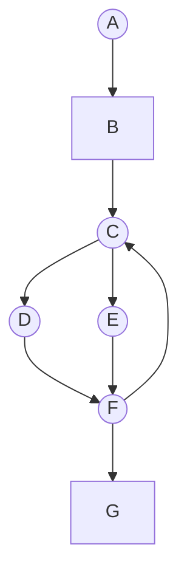
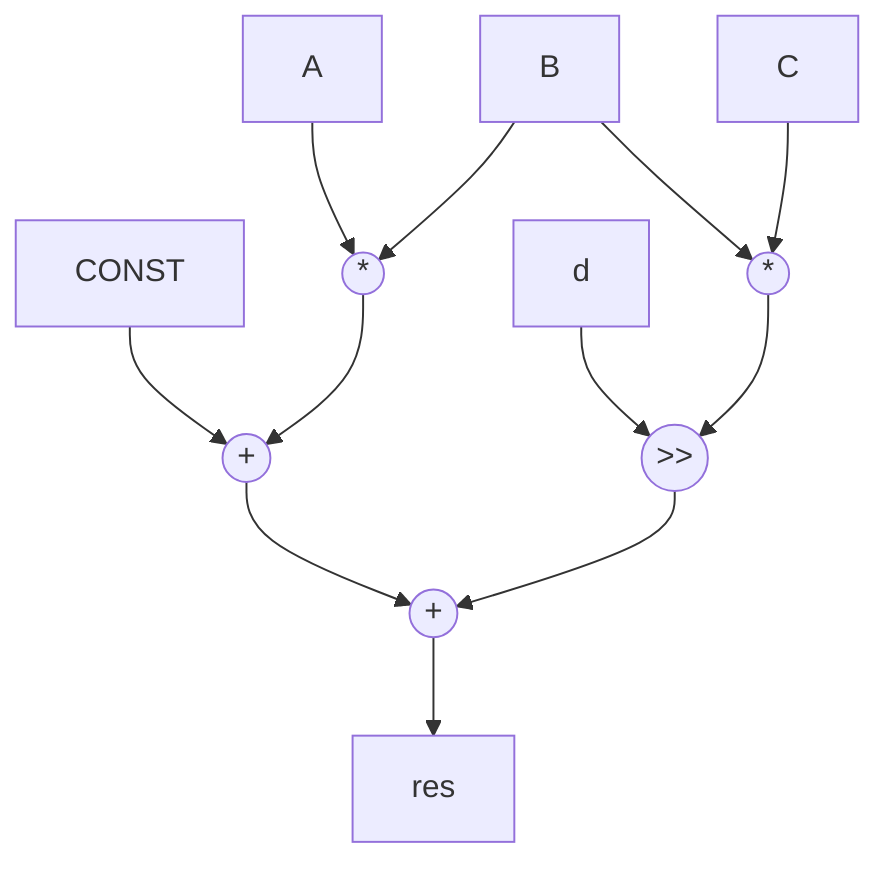

# Instruction Level Parallelism (ILP)

- The core idea of ILP is to identify and execute multiple instructions simultaneously to improve performance
- ILP techniques focus on exploiting parallelism _within_ a sequential stream of instructions, rather than relying on multiple threads of execution

```ad-summary
Basically, in hardware, we can just do all operations in parallel and mux their outputs instead of branching. This improves latency
```

## Control Flow Graphs (CFGs)

- A CFG is a graphical representation of the possible paths of execution within a program
- HLS tools will take our top level function that we want to turn into hardware and extract a CFG

```ad-info
- **Nodes:** The nodes of a CFG represent **basic blocks**
- **Edges:** The edges represent the control flow (jumps, branches) between basic blocks
```

### Basic Blocks

- A basic block is a sequence of instructions with the following key properties:
  - **Single entry point:** Execution always starts at the top of the block
  - **Single exit point:** Execution leaves the block only through the last instruction (often a branch)
  - **No branches within the block:** This ensures predictable execution flow within the block
    - if you have a branch within a function that still stays within the function, you must split the function into multiple blocks
- It is important to break processes into __basic blocks__ so that HLS tools can analyze the instructions within a block without worrying about how control flow from other blocks might interfere

```ad-warning
Instuctions can only be reordered or scheduled in parallel if __data dependencies are respected__
```

### Example

```c
a, c = 0;                   // block A
x = rand();                 // block B
if (x > 0) // loop:         // block C
	a+=x;                   // block D
else
	a-=x;                   // block E
c++;                        // block F
if (c<CONST) goto loop      // block F
printf("%d", a);            // block G
	
```



```ad-info
- Circles to represent basic blocks
- Squares are functions (depending on the complexity, they can be basic blocks or can be expanded into their own CFGs) 
```

## Dataflow Graph (DFG)

- In order to parallelize instructions, we must know all of the __data dependencies__

  - We cannot do 2 operations in parallel when one operation depends on the data from another!

- To represent the __data dependencies__ between operations we use a data-flow graph

  - operations are nodes, dependencies are edges

#### example 1

```c
int a, b, c, d;
const int CONST; // easy to repr with logic HI/LOs
int tmp1 = a*b;
int tmp2 = b*c;
int res = tmp1 + CONST + (tmp2>>d);
```



- registers are inserted in the DFG to shorten critical path length

  - critical path: the longest path
  - this creates clocked stages

- the datapath design steps:

  - (a) scheduling - assign operations to stages (clock cycles)
  - (b) mapping - assign operations to components in your design

```ad-info
See the [05-pipelining](05-pipelining.md) and [06-scheduling](06-scheduling.md) lecture notes for a more in depth understanding
```

#### example 2

- eg assume that `mult`, `addition`, `shifting` all take 1 cycle


- in the above example, we have chosen to mux the input to the adder so we can use it twice
  - the multiplexers cost less area than a second adder
  - they add a little latency but are probably not on the critical (timing) path
    - this circuit is moreso bottlenecked by the multiplier
      - multiplying is slower than the (mux+adder)
- additionally, to save hardware area we could reuse 1 multiplier instead of 2, with a longer schedule of 4 cycles

## Branch Flattening

- Branch flattening is the process of converting control flow into data flow
  - control flow is a sequential programming concept
  - data flow is a hardware concept

#### example


- in this example, basic blocks `BB2` and `BB3` can be optimized into 1 basic block

```ad-tip

- Try to structure branches so that they calculate values to be assigned to a variable
	- Use ternary operators!
- This allows flattening which is important for achieving good performance
```
