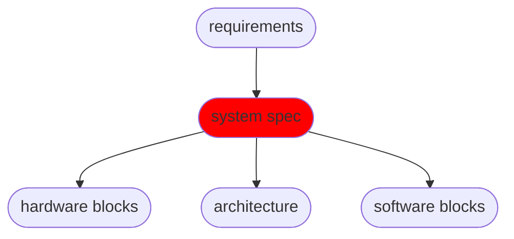
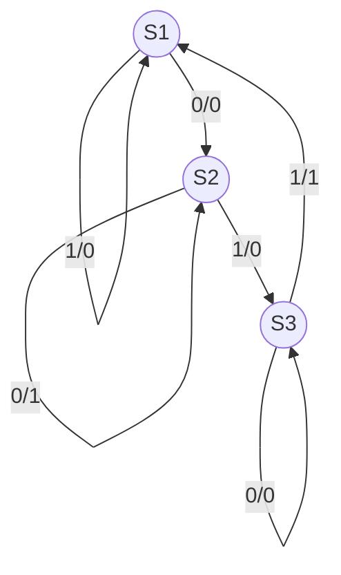
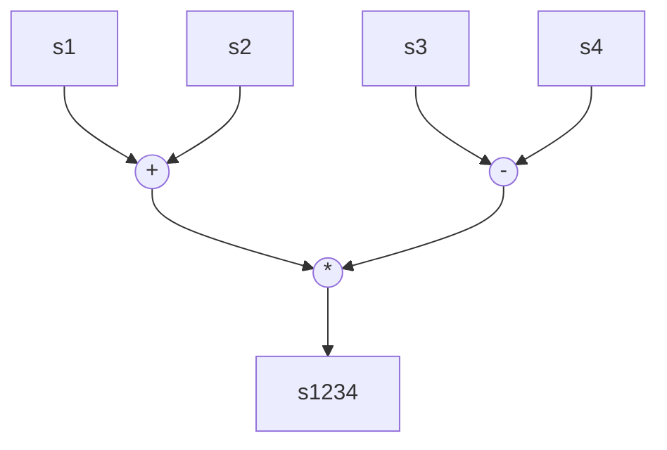

---
date:
status: backlog
tags:
  - '#hwe/embedded-computer-systems'
---

# Models of Computation

## Introduction

- Recall:

- the high-level system specification:
  - needs to express parallelism
  - is used for
    - (1) simulation (if its executable)
    - (2) formal verification: proving properties mathematically
    - (3) partitioning & scheduling - maps blocks to processing elements
    - (4) code generation - automatically generate software and hardware (e.g. HLS)

## What about C/C++

- problem #1: hard to express parallelism correctly
  - threading model is fundamentally non-deterministic
  - interleaving of operations is possible by default
  - race conditions occur by default
    - programmer must restrict parallelism to ensure correctness (mutex, semaphores, conditional variables)
  - however $\uparrow$ synchronization $\implies$ $\downarrow$ parallelism, $\downarrow$ performance
  - bugs are hard to find
  - it would be safer to have a deterministic model where the programmer specifies which parallelism to allow: trades safety for performance
- problem #2: there is no explicit concept of time
  - must use (system) libraries for timing
  - compiler can't check timing correctness
  - e.g. pthread library does have timed waits but its not part of the language standard

## High Level Specification Language Requirements

- (1) Hierarchical
  - Humans not good at managing or reasoning systems of $>5$ objects
  - types of hierarchy
    - behavioural (states processes)
    - structural (processor, PCB, ,node)
- (2) Compositional Behaviour
  - We can derive system properties/behaviours from those of the sub systems
- (3) Intrinsic Representation of Time
  - support delays, timeouts, deadlines
- (4) Efficient Implementations

## Model Classification

- control oriented: eg state mahcines (good for reactive systems)
- data-oriented eg dataflow (good for signal processing)

## state machines

### mealy machines

- can produce the output stream given initial state and input stream
  
- problems:
  - no parallelism, were only in one state at a time
  - state explosion: number of states explode when we begin to represent more complex things
- solution:
  - hierarchical composition of state machines (eg state charts)

## Simple Dataflow Graph (dfg)

- Nodes: data operations
- Edges: data dependencies
- a stream is associated with each edge (FIFO)
- timing in a simple dfg is based on the arrival of input tokens
- a simple dfg has a simple node firing rule:
  - it needs a token at each of its inputs and comsumes them (tokens)
    - execution consumes one token on each incoming dge and produces one token on each outgoing edge
- limitations
  - no conditional execution
  - no loops
- solution:
  - more expressive dfm (eg kahn process networks)
