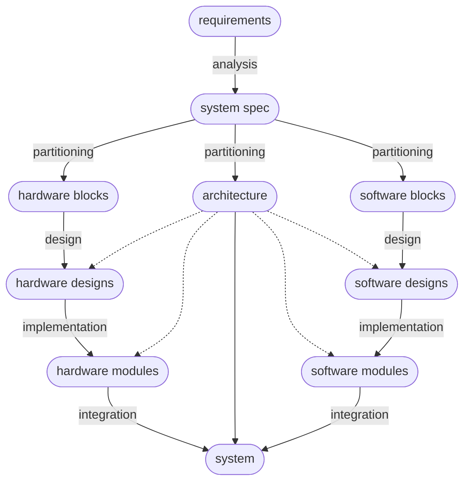

---
tags:
  - '#hwe/embedded-computer-systems'
  - '#type/area'
---

[2.1 high-level-synthesis](high-level-synthesis.md)
[2.2 instruction-level-parallelism](instruction-level-parallelism.md)
[2.3 data-level-parallelism](data-level-parallelism.md)
[2.4 transaction-level-parallelism](transaction-level-parallelism.md)
[2.5 matrix-multiplication-application](matrix-multiplication-application.md)
[3.1 models-of-computation](models-of-computation.md)
[3.2 kahn-process-networks](kahn-process-networks.md)
[3.3 synchronous-data-flow](synchronous-data-flow.md)
[3.4 task-graph-scheduling](task-graph-scheduling.md)
[3.5 periodic-task-graphs](periodic-task-graphs.md)
[3.6 state-chart](state-chart.md)
[4.1 performance-estimation](performance-estimation.md)
[5.1 processing-elements](processing-elements.md)
[5.2 app-specific-instr-procs](app-specific-instr-procs.md)
[5.3 asip](asip.md)
[6.1 memory-organization](memory-organization.md)
[7 energy-optimization](energy-optimization.md)

# Introduction to Embedded Computer Systems

## Embedded Systems

- DEFINITION: embedded system
  - a computing system designed for a specific purpose, made of purpose-built hardware and software
  - examples: microwave oven, smart watch, engine control unit, nuclear reactors

> Cars contain 70-100 electronic control units (ECUs) and ~100 million lines of code. As a comparison Boeing 787 has 14 million lines of code
>
> - An engineer from porsche

- embedded systems can be separated by whether or not they are safety-critical

|                      | safety critical                    | non-safety critical                      |
| -------------------- | ---------------------------------- | ---------------------------------------- |
| cost of failure      | high (loss of life)                | low                                      |
| real-time contraints | hard                               | soft                                     |
| analysis             | worst-case performance             | average-case performance                 |
| verification         | extensive testing / formal methods | testing (partial)                        |
| design goals         | reliability, certification         | quality of service, cost, time-to-market |
| design cycle         | long (10-20 years for aerospace)   | short (0.5-1 year for smartphones)       |

## Hardware Software Co-Design

- What is hardware software co-design?
  - the concurrent design of hardware and software so as to better meet design constraints such as cost, power consumption, and performance

### Hardware/Software Co-design Flow

- (1) requirements specification defines:

  - functional requirements (what it should do) (eng. requirements)
    - e.g. play back mpeg-4 video files
  - non-functional requirements (how it should do it) (eng. constraints)
    - e.g. max cost, max power draw, min frame rate, min video file storage, max time to market

- (2) analysis (top-level designer/system architect)

  - determine how the project can be realized
    - e.g. algorithms,  opportunities for parallelism

- (3) system specification (aka high level spec.)

  - implementation independent
    - then you take this and target it to hardware and architectures
  - a set of functional blocks
  - can be described with various models (state charts, systemC) -- possibly executable or simulate-able, to facilitate analysis/estimation
    - e.g. for video playback: file selection (via push buttons), file parsing, image decoding,
    - or even plain language?

- (4) Hardware/Software partitioning

  - determine architecture (platform i.e. boards, processors, etc)
  - partition functional blocks into hardware blocks and software blocks

- (5) architecture

  - a set of processing elements (PEs, software or hardware) that execute the functional blocks, one element can handle multiple blocks
    - e.g. in our projects, FPGA for hardware blocks (Zynq 7000 SoC programmable logic)
    - e.g. Instruction Set Processor (ISP) (aka CPU) for software blocks (Zynq 7000 SoC dual core ARM A9 processor)
  - interconnect between PEs
    - e.g. Advanced Microcontroller Bus Architecture - includes AXI, APB for connecting to hardware
  - other hardware elements such as memories, I/O
    - e.g. 512 MiB DDR3 memory, DMA controller, HDMI port

- (6) Hardware/Software design

  - detailed specification for each functional block
    - e.g. state machines and dataflow diagrams for hardware
    - e.g. set of threads and UML diagrams for software

- (7) Implementation

  - translate detailed specifications into

Design Technologies (increasing integration, decreasing flexibility)

- (1) Networked System

  - processing nodes connected by off chip network
    - e.g. automotives: ECUs connected by CAN bus (controller area network)

- (2) Multi-board Systems

  - e.g. VME bus standard: a chassis with compute, memory, and I/O cards (superceded by VPX)
    - widely used in aerospace and military applications
  - e.g. PC with PCIe expansion cards
  - e.g. Arduiono expansion boards (shields)

- (3) Custom PCB

  - discrete chips integrated on custom printed circuit board
  - e.g. common in commercial applications

- (4) SOC (system on a chip)

  - all compone

- Advantages of integration:

  - increased communication bandwidth
  - reduced cost, weight, energy consumption

## SOC circuit technologies

- (1) Field Programmable Gate Array (FPGA):
  - reprogrammable (SRAM) or one-time-programmable (fixed)
  - lower high design cost high per-unit cost
  - lower performance (measured in 100s of MHz)
  - good for prototyping and low-volume production
- (2) Application Specific Integrated Circuit (ASIC)
  - custom chip design
  - very high design cost but low per-unit cost
  - higher performance (measured in GHz) and lower power consumption
  - good for high volume production
